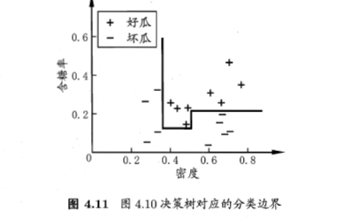
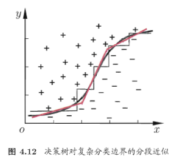

####1.基本流程

决策树（decision tree）包含一个根节点、若干个内部节点和若干个叶节点。根节点和内部节点对应于一个属性测试，叶节点对应决策结果。所有样本集合从根节点开始进行属性测试，根据属性测试的结果被分配到子节点中。根节点到叶节点的路径对应一个判定测试序列。

决策树学习的目的是为了产生一棵泛化能力强的决策树，基本流程遵循“分而治之”

####2.划分选择

##### 2.1 信息增益

​    “信息熵”（information entropy）是度量样本集合纯度最常用的一种指标，信息熵的值越小，样本集合的纯度越高。假定当前样本集合D中第k类样本所占比例为$p_k$(k=1,2,...,|У|)，则D的信息熵为

$Ent(D)=-\sum_{k=1}^{|У|}{p_klog_2p_k}$

​    “信息增益”（information gain）用于衡量使用某个样本属性a来划分样本集合D获得纯度提升的指标，一般而言，信息增益越大，提升越大。假定a有V个可能取值{$a^1$,$a^2$...,$a^V$}，若使用a对样本集合D进行划分，产生的V的结点中，每个结点v包含了D中所有在属性a上取值为$a^v$的样本（全部根蒂为卷曲的西瓜）。则该划分的信息增益为

$Gain(D,a) = Ent(D)-\sum_{v=1}^V{\frac{|D^v|}{|D|}}Ent(D^v)$

##### 2.2增益率

​    “增益率”（gain ratio）可以用来选择最优划分属性，减少属性的固有值对信息增益的影响。增益率的定义为

$Gain\_ratio(D,a)=\frac{Gain(D,a)}{IV(a)}$。

​    $IV(a)$为属性a的“固有值”（intrinsic value），属性a额能取值数目越多（即V越大），$IV(a)$就越大。属性a的固有值的定义为

$IV(a)=-\sum_{v=1}^{V}\frac{|D^v|}{|D|}log_2\frac{|D^v|}{|D|}$。

​    信息增益准则对$IV(a)$值高的属性有所偏好，但是增益率准则对属性固有值小的属性有所偏好。在C4.5算法中使用了一个启发式：先从选择划分属性中找出信息增益高于平均水平的属性，再从中选择增益率最高的。

##### 2.3基尼指数

​    基尼值反映了从数据集D中随机抽取两个样本，其类别标记不一致的概率，基尼值越小，样本纯度越高。基尼值定义为

$Gini(D)=\sum_{k=1}^{|У|}\sum_{k'\neq{k}p_kp_k'}=1-\sum_{k=1}^{|У|}p_k^2$，

​    “基尼指数”（Gini index）为样本划分后属性纯度提升的指标，基尼指数最小的属性为最优划分属性，基尼指数的定义为

$Gini\_index(D,a)=\sum_{v=1}^{V}\frac{|D^v|}{|D|}Gini(D^v)$

####3.剪枝处理

​    剪枝（pruning）可用于防止决策树模型的“过拟合”。基本策略有“预剪枝”（prepruning）和“后剪枝”（postpruning）

​    预剪枝是自顶向下的策略，在决策树生成过程中，对结点在划分前进行估计，如果该结点划分后不能对决策树的泛化性能带来提升，则停止划分。

​    后剪枝是自底向上的策略，在决策树生成后，若非叶子不进行分裂能带来决策树泛化性能的提升，则将该子树替换为叶子结点。

####4.连续与缺失值

##### 4.1连续值的处理

​    连续属性可以使用离散化的技术进行属性划分，最简单的是“二分法”。样本集D上的连续属性a，将熟悉a从小到大排序，记为{$a^1$,$a^2$...,$a^n$}，基于划分点t可将D划分为$D_t^-$和$D_t^+$，$D_t^-$为样本集D在属性a上不大于t的，$D_t^+$为为样本集D在属性a上大于t的。可对基尼指数稍加改造，选取连续属性的最优划分

$Gain(D,a)=\max\limits_{t\in{T_a}}Gain(D,a,t)$

$=\max\limits_{t\in{T_a}}Ent(D)-\sum\limits_{λ\in\{-,+\}}\frac{|D_t^λ|}{|D|}Ent(D_t^λ)$

##### 4.2缺失值处理

缺失值处理需要解决两个问题：

（1）如何在属性值缺失的情况下进行划分属性选择？

（2）给定划分属性，若样本在该属性上的值缺失，如何对样本进行划分？

**问题（1）**的一个解决方案（C4.5的方案）是在计算Gini指数时，只计算样本集中无缺失值的样本，再乘上无缺失值样本数与总样本数之比。定义样本集D和属性a，$\tilde{D}$表示D中在属性a上没有缺失值的样本子集。假定a有V个可能取值{$a^1$,$a^2$...,$a^V$}，$\tilde{D^v}$表示$\tilde{D}$在a上取值为$a^v$，$\tilde{D^k}$表示$\tilde{D}$中属于第k类的样本子集，$w_x$为样本x的权重，默认初始化为1。

$ρ=\frac{\sum_x\in{\tilde{D}}w_x}{\sum_x\in{D}w_x}$ ，表示无缺失值样本所占的比例

$\tilde{p}_k=\frac{\sum_x\in{\tilde{D}_k}w_x}{\sum_x\in{\tilde{D}}w_x}$ (1 ≤ k≤ |У|)，表示无缺失值样本中第k类所占的比例

$\tilde{r}_v=\frac{\sum_x\in{\tilde{D}^v}w_x}{\sum_x\in{\tilde{D}}w_x}$ (1 ≤ v ≤ V)，表示无缺失值样本中在属性a上取值为$a^v$所占的比例

可将信息增益的计算式推广为

$Gain(D,a) =ρ×Gain(\tilde{D},a)$

​                      $= ρ×Ent(\tilde{D})-\sum\limits_{v=1}^V\tilde{r}_vEnt(\tilde{D}^v)$

其中，$Ent(\tilde{D})=-\sum\limits_{k=1}^{|У|}{\tilde{p}_klog_2\tilde{p}_k}$

**问题（2）**的一个解决方案：若样本在划分属性a上的取值已知，则将x划入对应子节点，且样本权重保持$w_x$；若样本x在划分属性a上的取值未知，则将x同时划入所有子节点，且样本权重在属性值$a_v$对应的子节点中调整为$\tilde{r}_v·w_x$。**直观的看，就是让同一个样本以不同的概率划入到不同的子节点中。**

**缺失值的另一个解决方案：在实际项目中，从特征工程的角度，如果样本集中缺失值为少量，可以依据情况进行缺失值的填补，可使用属性的均值、中值、众数进行填补。如果只是个别样本存在缺失值也可以考虑剔除个别样本。**

####5.多变量决策树

​    若我们把每个属性视为坐标空间中的一个坐标轴，则在d个属性描述的样本就对应了d维空间的一个数据点，对样本的划分就是寻找坐标空间中各类样本之间的分类边界。决策树形成的划分边界有个特点：轴平行。这种为单变量决策树

而多变量决策树的非叶子结点通过对属性的线性组合，可以实现斜线划分。

