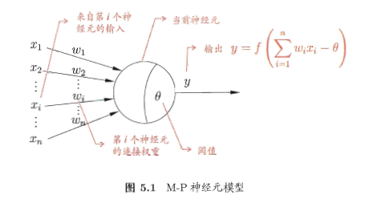

###  5.1神经元模型

​    西瓜书中采用的定义：“神经网络是由具有适应性的**简单单元**组成的广泛并行互联的网络，它的组织能够模拟生物神经系统对真实世界所作出的交互反应”。

​    “M-P神经元模型”，接收n个其他神经元传递来的输入信号，这些输入信号通过带权重的连接进行传递，将总输入值与神经元的阈值进行比较后通过“激活函数”处理，最后产生神经元的输出。

### 5.2 感知机与多层网络

​    感知机（Perceptron）由两层神经元组成，可以处理逻辑与、或、非运算，即线性可分的问题。但不能处理复杂的异或问题，即非线性线性可分问题。

​    多层网络（multi-layer neural）可以解决非线性可分的问题，多层网络除了输出层与输入层，还有中间的隐含层（hidden layer）。多层网络中，每层神经元与下一层神经元全互连，神经元之间不存在同层连接，也不存在跨层连接，称为“多层前馈神经网络”（multi-layer feedforward neural）。

###  5.3误差逆传播算法

​    误差逆传播（error BackPropagation）算法基于梯度下降策略，以目标的负梯度方向更新参数。

​    标准BP算法 --随机梯度下降，一个样本调整一次参数    

​    累积BP算法 --标准梯度下降，所有样本调整一次参数（或者一个batch样本调整一次）

### 5.4全局最小和局部极小

​    神经网络的训练过程存在两种最优：“局部极小”（local minimun）和“全局最小”（global minimun）

​    跳出局部极小的方法：    

​    a.以多组不同参数值初始化神经网络，相当于从多个不同的初始点开始搜索    

​    b.模拟退火    

​    c.使用随机梯度下降    

**需要注意的是，跳出局部极小也有可能跳出全局最小**

### 5.5其他常见的神经网络

RBF（Radial Basis Function，径向基函数）网络    

ART（Adaptive Resonance Theory，自适应谐振理论）网络    

SOM（Self-Organizing Map，自组织映射）网络    

级联相关网络    

Elman网络（递归神经网络）    

Boltzmann机

###  5.6深度学习

深度学习网络的隐含层在三层以上。

理论上，参数越多模型复杂度越高，“容量”（capacity）越大，意味着能完成更复杂的学习任务。但复杂模型存在训练效率低，容易过拟合的问题。

模型的复杂度可以通过增加隐含层的神经元个数，但是获得的收益没有增加隐层层数高。增加隐含层的数目不仅增加了神经元数目，还增加的激活函数的嵌套层数，但是同时会带来误差发散的问题。

解决方法：      

a.无监督逐层训练，深度信念网络      

b.权共享，CNN